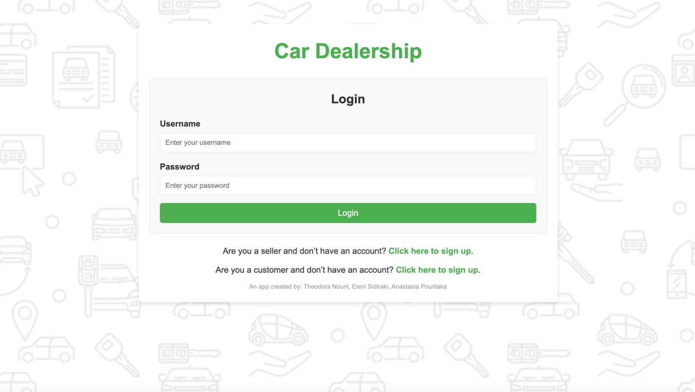

# Car dealership

A project the has been created for the needs of the course "Cloud Service Development".

## Installation

1. Install XAMPP, so that you can use the mysql local server.
2. Use the file car_dealership.sql that is included in this repository & create all the required database tables.
3. Install [Maven](https://maven.apache.org/install.html)
4. Build the app: `mvn clean install`
5. Finally, run the app:
```bash
  mvn spring-boot:run
```
6. Find the app in this url: http://localhost:8080/login



## Documentation

Information regarding the app (use cases & code) can be found [here](#).

_University of Macedonia, 2025_

_Authors: Theodora Nouni, Eleni Sidiraki, Anastasia Pourliaka_